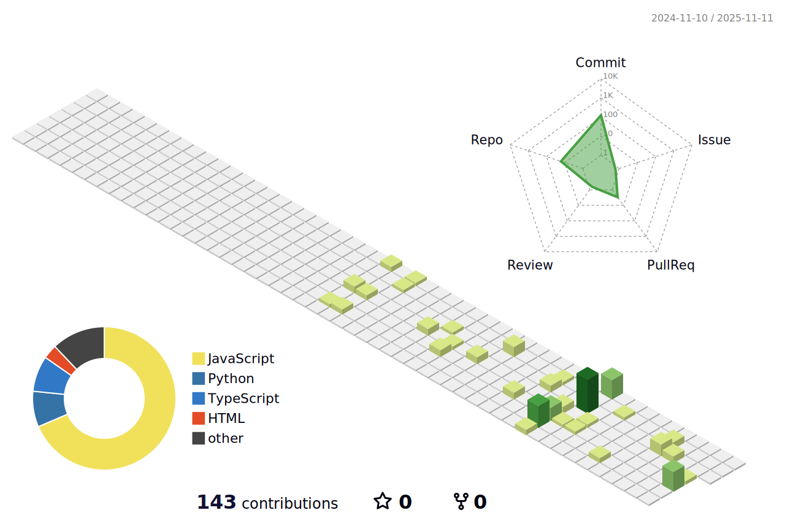

# 👋 Hi there! I'm Juan Esteban Castillo Guardia

🎓 **Software Engineering student** at *Unisabaneta*  
💻 **Backend developer** passionate about clean architecture, scalable APIs, and data-driven systems.  
📍 Based in Colombia | 🌐 Building solutions that connect logic, structure, and purpose.

---

## 🚀 About Me

I’m a software engineering student and backend developer focused on designing and building robust, modular, and well-tested APIs.  
I’ve spent the last year working through multiple real-world projects at **Riwi**, a work-life simulation center, where I’ve practiced modern software engineering processes such as:

---

### 🛠️ Tecnologías

  

---

- 🔹 Gitflow branching and version control
- 🔹 Agile development with sprints, user stories, and acceptance criteria
- 🔹 CI/CD principles and test coverage tracking (≥40%)
- 🔹 Dockerized deployments and resource management

I approach every project as a **system**, not just a set of scripts — meaning I care about structure, reliability, and long-term maintainability.

---

## 🧠 Core Technologies

| Domain | Stack |
|:--|:--|
| **Backend Frameworks** | NestJS, Express, TypeScript |
| **Databases** | PostgreSQL, Supabase, Sequelize ORM |
| **Tools & Config** | Docker, Git, ESLint, Jest, ts-node-dev |
| **Architecture** | REST API Design, Modular Services, DTOs, Validation Pipes |

---

## 🧩 Highlighted Projects

| Project | Description |
|:--|:--|
| **FHL-Logistics-API** | Backend for logistics and inventory management; modular architecture with Sequelize and Postgres. |
| **Library-App** | Library management REST API built with NestJS and PostgreSQL, using DTOs, guards, and pipes. |
| **SportsLine** | Sports event platform managing teams, schedules, and analytics dashboards. |
| **Epic 1.0** | Scalable multi-user application showcasing entity relationships and API best practices. |

Each project includes proper **entity diagrams**, **seeders**, **migrations**, and **tests**, following clean code conventions and Dockerized environments.

---

## ⚙️ Developer Philosophy

> “Write code that explains itself, document what doesn’t.”

I believe backend development is both science and art — balancing logic, architecture, and human readability.  
Every function, module, and entity should have a reason to exist.

---

## 📫 Contact

- 📧 Email: *[Jecg050505@gmail.com]*
- 🌍 Portfolio (coming soon...)

## 🌐 My 3D Contribution

---

> _“Technology means nothing if it doesn’t serve people. I build systems that do.”_

---
# DuskForge-interactive
